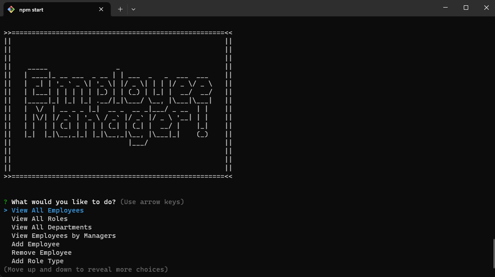

# Discover-CMS

[](https://opensource.org/licenses/MIT)

Discover CMS is a comprehensive employee management system designed to streamline the process of managing employee records within an organization. It allows users to dynamically add, update, and view employee details, including their names, roles, departments, and managers, through an intuitive command-line interface. The system fetches and updates information in real-time from a relational database, ensuring that all data is current and accurately reflects the organizational structure. Key features include the ability to assign employees to specific departments and roles, update their managerial status, and retrieve detailed reports based on departmental or managerial hierarchies. By automating these administrative tasks, the project significantly enhances operational efficiency and provides organizational leaders with valuable insights into their workforce.

## Table of Contents
- [Installation](#installation)
- [Usage](#usage)
- [Preview](#usage)
- [Questions](#questions)
- [License](#license)

## Installation

> **_NOTE:_**
> This package assumes you already have Node.js and npm installed. If you don't, [download Node.js](https://nodejs.org/en/download) first then come back to these installation steps.

1. Open your terminal and clone the github repo:

```
git clone https://github.com/hokage-216/discover_cms.git
```

2. 'cd' into the folder:

```
cd discover_cms
```

3. Then run this command to install the required packages:

```
npm install
```

## Usage

After installing required packages, you are able to run:

```
npm start
```

The program will begin allowing you to answer each prompt accordingly.



## Preview

Click the image below to view a live demonstation.

[](https://youtu.be/GTsW5hLtMfo)

## Questions

If you have any questions about the repo, open an issue or contact me directly at berrylevente@hotmail.com.

To view more of my work [click here](https://github.com/hokage-216/).

## License

Copyright (c) 2024 LeVente Berry Jr.

Licensed under the MIT license. To view the license terms [click here](https://opensource.org/licenses/MIT).


